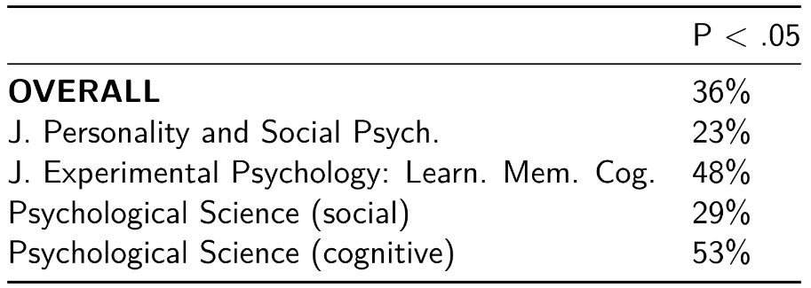

# (PART) Foundations {-}

# Quantitative Research

> One of the many goals of quantitative methods is to make reliable conclusions from the observations you make. 

There are many radically different ways to acquire and analyse data.
From the traditional, mainstream psychologist's perspective, there is a well-tried formula on how you should go about it.
Its goal is to test explanations of behaviour — to narrow down the vast number of explanations you can build to explain human behaviour.
If you are a behavioural scientist, a rudimentary and user-friendly scientific method might look like this:

* Hypothesis: Given condition X, we will see people do Y.
* Measurement: Make observations under condition X.
* **Test: Did we observe people do Y?**

I would like to emphasize that this is a rudimentary, straightforward empirical test of a given explanation.
It can be a powerful tool.
Nonetheless, this is only one of the countless ways science can be carried out.

## Hypothesis: Given condition X, we will see people do Y.
## Measurement: Make observations under condition X.
## **Test: Did we observe people do Y?**

In order to do this, you are required to reliably conclude from the data (observations) you have.
This is where statistics and R come in.
While human reasoning is powerful, it is influenced by human biases, very limited cognitive capacity, and also by simple tiredness.
It is actually very hard to evaluate evidence without pre-existing beliefs.

* Andy Wills: Science, Truth, Honesty [slides](https://www.andywills.info/critical-thinking/ScienceTruthHonestyInteract.pdf) [notes](https://www.andywills.info/critical-thinking/ScienceTruthHonestyNotesInteract.html) [course](https://www.andywills.info/critical-thinking/#ct-lectures)
* Todd Gureckis: Why do we learn statistics? [video](https://vimeo.com/508505679) [chapter](http://gureckislab.org/courses/spring21/labincp/chapters/01/00-whystats.html#video-lecture).

# Reproducibility Backlash

One of the most important endeavours that science as a social enterprise can engage is to verify each other's observations through independent replications.
The reason behind this is simple: repeated observations will increase our confidence that the effect is real.

## Reproducibility Crisis

<figure>
</a>
<figcaption> Image was taken from [Open Science Collaboration (2015)](https://doi.org/10.1126/science.aac4716) </figcaption>
</figure>

## Some causes we can fix by changing how we do and document our analysis

1. Misunderstanding of statistics
2. Low reproducibility (experiments, **analysis**)
3. Poor records
4. Not sharing data openly

* Andy Wills: Fix the replication Crisis [video](https://www.youtube.com/watch?v=_OqiTVq12Pk)

* David Shanks: The replication crisis in psychology [video](https://www.youtube.com/watch?v=Zz627CecmgU)

* David Shanks: Does social science tell the truth? [video](https://www.youtube.com/watch?v=Jt7gEAoUl8s)

* Priya Silverstein: Easing into open science [video](https://www.youtube.com/watch?v=owJaD3UiseQ)

# Open Science

# Why R?

* Free as in Freedom

> Costs £0.

* Documents your analysis

> Any conclusion people make from data should stand independent of the person making
> the conclusion.

* Open Source

> If you do the same tests on the same data, but get a different result, the difference must be about how the authors programmed the test.

* Data preprocessing

> People roughly spend 80% of their time on data preprocessing, see [article](https://www.forbes.com/sites/gilpress/2016/03/23/data-preparation-most-time-consuming-least-enjoyable-data-science-task-survey-says/#5e7ed02f6f63).
> R is superb at preprocessing, saving a large amount of time — especially for multiple projects.

* Danielle Navarro: R for Psychological Science? [video](https://www.youtube.com/watch?v=xFkEbYk0C0Q)

# (PART) Design {-}

# Project Design

# Analysis Pipeline

**The published paper is only a summary of what you have done, it is not the perfect
record of how you arrived at a certain statistical conclusion.**

Using R allows you to complement your paper. It will let you:

* Records every analysis step.
* Inspect the way how your peers calculated the results.
* Reproduce analysis and let others reproduce yours.

[Some reasons to use R](https://www.andywills.info/rminr/why-r-student.html)

# Reproducibility

# Archives
